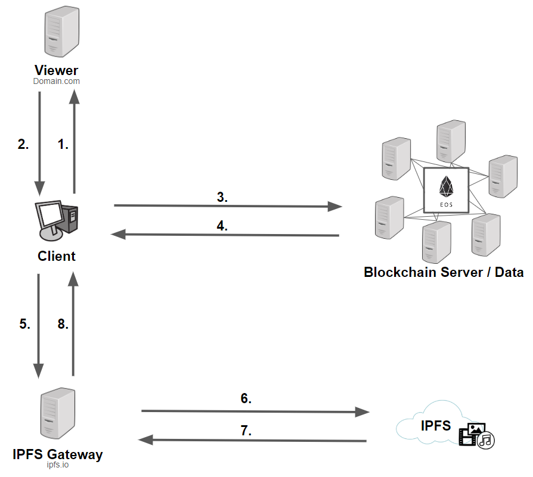

1. The server connects to the web server running the viewer.
2. The server transmits a list of IP addresses of blockchain nodes
3. The client sends POST/GET requests to individual listed blockchain nodes.
4. Client receives metadata (IPFS hash, comments, tags, author, ...) as a response 
5. The client establishes a connection to an IPFS gateway
6. The IPFS gateway establishes a connection to the IPFS network
7. The requested media is downloaded from the IPFS network
8. The IPFS gateway transfers the media to the client