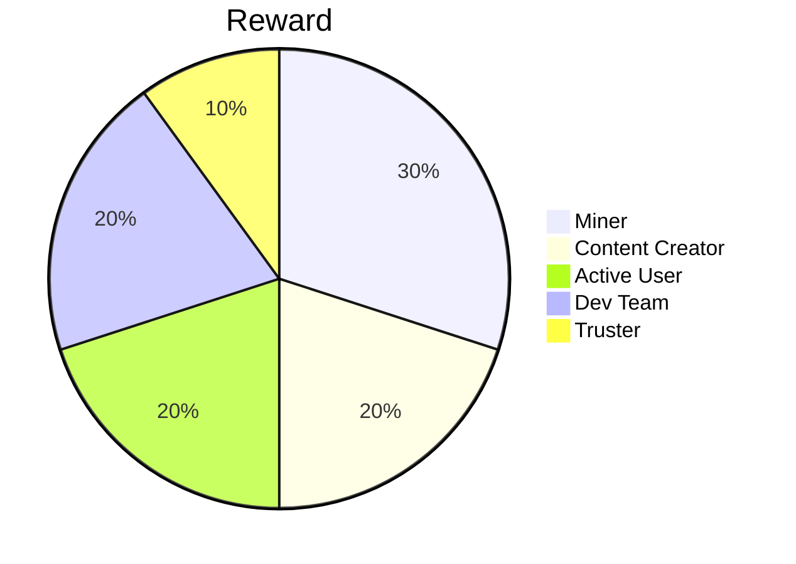

## Miner
People who keep the network running through their efforts (miners) receive a share of the generated coins as a reward.

## Content Creator
User who upload great content or write awesome comments are rewarded.
The user base decides for itself how the content is classified.

## Active User
Active users are rewarded as well. As activity counts:
- write comments
- add tags
- vote/classifing Content

## Dev Team
To keep the developing running a part of the newly generated coins goes into a pot, which can be used by the developers.

## Truster
Users who assess reported content and make a decision are also rewarded for their activity
